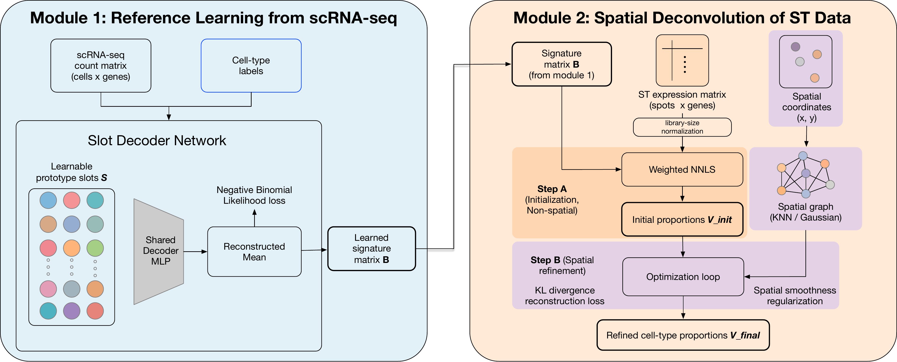

# SlotDeconv

<p align="center">
  
</p>

<p align="center">
  <a href="Fig1_framework.pdf">Workflow overview PDF</a>
</p>

SlotDeconv is a reference-based spatial transcriptomics deconvolution method for estimating spot-level cell-type proportions from spot-based spatial transcriptomics data. It learns discriminative cell-type signatures from annotated scRNA-seq data using slot-based prototype vectors and a diversity constraint, then estimates proportions with weighted NNLS initialization followed by spatial refinement.

This repository contains the core model implementation, a command-line runner, and a tutorial notebook for the ECCB 2026 manuscript:

**SlotDeconv: Spatial Transcriptomics Deconvolution via Diversity-Constrained Prototype Learning and Spatial Refinement**

## Repository Layout

- `model/slot_model.py`: SlotDeconv model, reference learning, NNLS initialization, and spatial refinement.
- `model/run_slot.py`: command-line runner for one dataset directory.
- `model/slot_utility.py`: data loading, spot alignment, and evaluation metrics.
- `model/plot.py`, `model/visz.py`: plotting and validation utilities.
- `tutorial.ipynb`: tutorial notebook.
- `framework.png`: workflow overview image displayed in this README.
- `Fig1_framework.pdf`: workflow overview figure from the manuscript.
- `requirements.txt`: Python package versions used for the ECCB experiments.

## Installation

The ECCB experiments were run with Python 3.8.20. A minimal environment can be created with:

```bash
conda create -n slotdeconv python=3.8 -y
conda activate slotdeconv
pip install -r requirements.txt
```

The pinned package versions in `requirements.txt` are:

```text
numpy==1.23.5
pandas==2.0.3
scipy==1.10.1
scikit-learn==1.3.2
torch==2.0.1
matplotlib==3.7.5
seaborn==0.13.2
scanpy==1.9.8
anndata==0.9.2
```

The core command-line runner uses `numpy`, `pandas`, `scipy`, `scikit-learn`, `torch`, and `matplotlib`. The tutorial may additionally use plotting or single-cell analysis packages listed above.

## Input Format

`model/run_slot.py` expects a dataset directory containing:

```text
sc_count.csv          genes x cells scRNA-seq count matrix
st_count.csv          genes x spots spatial transcriptomics count matrix
sc_meta.csv           cell metadata indexed by cell id, with a cellType column
spatial_location.csv  spot coordinates indexed by spot id
eval_types.txt        one evaluated cell type per line
true_props.csv        optional, spots x cell types ground truth for benchmarking
```

Spot IDs must match between `st_count.csv` columns and `spatial_location.csv` rows. If `true_props.csv` is present, the same spot IDs are used for evaluation. Gene names are aligned between `sc_count.csv` and `st_count.csv` before fitting.

The CSV input files are stored as genes-by-samples for convenient loading. This file-format convention differs from the manuscript notation, where the corresponding aligned matrices are written as samples-by-genes.

## Quick Start

Download the processed VX benchmark data from the Google Drive folder below and place the CSV files in a local dataset directory such as `data/`. From the repository root, run:

```bash
PYTHONPATH=model python model/run_slot.py \
  --data_dir data \
  --output_dir results/example_mousebrain
```

Expected outputs:

```text
results/example_mousebrain/predicted_props.csv
results/example_mousebrain/predicted_props_nnls.csv
results/example_mousebrain/metrics_all.csv
results/example_mousebrain/metrics_valid.csv
results/example_mousebrain/celltype_metrics.csv
```

`predicted_props.csv` contains the spatially refined cell-type proportions. `predicted_props_nnls.csv` contains the NNLS-only initialization. Metric files are written when `true_props.csv` is available.

To run the non-spatial NNLS-only ablation:

```bash
PYTHONPATH=model python model/run_slot.py \
  --data_dir data \
  --output_dir results/example_mousebrain_nnls \
  --no_spatial
```

## Tutorial

The tutorial notebook `tutorial.ipynb` demonstrates the expected data format and a basic SlotDeconv run. For other datasets, prepare the six input files listed in the `Input Format` section and pass the directory with `--data_dir`.

Baseline prediction CSVs for Spotiphy, Cell2location, RCTD, and CARD are not generated by SlotDeconv; generate them with the corresponding method implementations if you want to reproduce cross-method benchmark tables.

## Public Data and Accession Links

Processed VX benchmark data and manuscript-ready CSV inputs are provided through the project data folder:

- Google Drive data folder: <https://drive.google.com/drive/folders/1g4hI43KkMrIvbrhmtgoLpS8MEbw5pNU4?usp=drive_link>

Public source datasets used in the manuscript:

- Mouse brain benchmark and Xenium-aligned ground-truth proportions: Spotiphy study, Zenodo record 10520022, <https://zenodo.org/records/10520022>
- Human pancreatic ductal adenocarcinoma spatial transcriptomics: Moncada et al., GEO GSE111672, <https://www.ncbi.nlm.nih.gov/geo/query/acc.cgi?acc=GSE111672>
- Mouse olfactory bulb scRNA-seq reference: GEO GSE121891, <https://www.ncbi.nlm.nih.gov/geo/query/acc.cgi?acc=GSE121891>

The processed mouse brain benchmark is referred to here as the VX benchmark data. The processed count matrices are distributed through the data folder rather than stored in this repository because they are several gigabytes in size.

## Citation

If you use SlotDeconv, please cite:

```text
Fang H, Qi C, Zou Y, Chen Y, Wei Z. SlotDeconv: Spatial Transcriptomics
Deconvolution via Diversity-Constrained Prototype Learning and Spatial
Refinement. Accepted to the ECCB 2026 Proceedings Track and for inclusion
in the Bioinformatics proceedings, pending OUP editorial checks.
```

## Contact

For questions about the manuscript or code, please contact the corresponding author listed in the paper.
